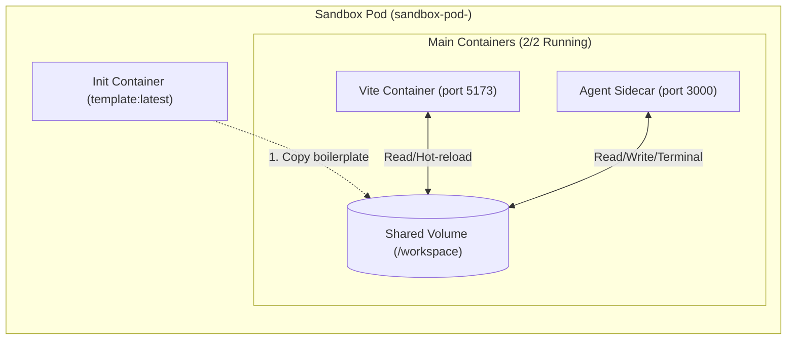
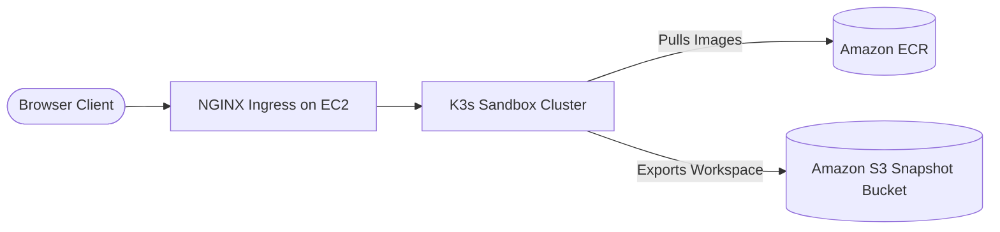

# 🚀 Flowent — Cloud AI-Powered Sandbox IDE & Execution Engine

Flowent is a cloud-native, agentic developer platform that provisions isolated Kubernetes sandbox containers on demand, generates and edits full-stack React applications in real time using AI, renders live in-browser application previews, and provides an interactive terminal directly inside the container.

---

## 🌐 Live Production Deployment

- **Live Production URL**: [https://projectrs.me](https://projectrs.me)
- **SSL & Encryption**: Let's Encrypt Wildcard TLS (`projectrs.me`, `*.projectrs.me`) with automated host-level SSL termination.
- **Infrastructure**: AWS EC2 (`t3.medium`, `ap-south-1`) running K3s (Lightweight Kubernetes), NGINX Ingress Controller, Amazon ECR, and Amazon S3.

---

## 🌟 Comprehensive Feature Showcase

### 🤖 1. Agentic AI Code Orchestrator
- **Natural Language to Code:** Generates complete, functional React components, interactive games (e.g., Snake, Pong), dashboard widgets, and stylesheets from single prompts.
- **Tool Calling & Agent Loop:** The AI agent autonomously reads directory structures, inspects existing files, creates new modules, and patches code directly into the sandbox filesystem.
- **Live SSE Streaming & Execution Logs:** Real-time visibility into the AI's step-by-step thinking process and tool operations via Server-Sent Events (SSE).

### ⚡ 2. Ephemeral Kubernetes Sandbox Architecture
- **On-Demand Pod Lifecycle:** Programmatically provisions isolated multi-container Kubernetes pods for each sandbox session using `@kubernetes/client-node`.
- **Pre-Seeded Templates (`initContainers`):** Uses an initial bootstrap container (`initContainers`) to unpack a pre-configured Vite + React template into the workspace volume before starting main services.
- **Guaranteed Container Availability:** Employs an image-pinning DaemonSet (`sandbox-images-cache`) to ensure container runtime images (`template:latest`, `agent:latest`) are never evicted or garbage-collected.

### 📦 3. Real-Time Shared Volume Sync
- **Unified Storage (`/workspace`):** Both the **Vite Dev Server** (port `5173`) and the **Agent Sidecar** (port `3000`) mount the exact same `emptyDir` volume.
- **Instant Hot Module Replacement (HMR):** Any file written or patched by the AI or user triggers instant Vite hot reload inside the preview iframe with zero build latency.

### 🎨 4. Craftsman UI & Colorful Syntax Highlighting
- **Human-Crafted Aesthetic:** Non-generic, refined dark theme inspired by Linear and Raycast with deep charcoal tones and warm amber/emerald accents.
- **Strict 5px Border Radius:** Enforced consistent `rounded-[5px]` geometry across all cards, panels, inputs, buttons, and frames.
- **Prism.js Syntax Highlighting:** Colorful code viewing and editing for **JavaScript, JSX, TypeScript, TSX, Markdown, CSS, HTML, JSON, and Bash**.

### 💻 5. In-Browser Interactive Terminal Console
- **Full PTY Emulation:** Powered by `node-pty` in the backend and `@xterm/xterm` in the frontend.
- **Dedicated WebSocket Proxying:** Uses high-throughput, standalone `http-proxy` streaming to forward terminal frames without dropouts or socket leaks (`/api/agent/<sandboxId>/socket.io`).
- **Interactive Shell Features:** Run bash/sh commands, install dependencies with npm, inspect filesystem hierarchies, and view live stdout/stderr streams.

### 🌐 6. Embedded Live Preview Engine & Instant HMR
- **Sandboxed Iframe:** Renders the live application within the workspace IDE.
- **Single-Level Subdomain Architecture:** Previews are hosted at `https://<sandboxId>-preview.projectrs.me/`, guaranteeing full compliance with Wildcard SSL (`*.projectrs.me`) and preventing browser "Not Secure" mixed-content flags.
- **Flicker-Free Hot Module Replacement (HMR):** Edits update dynamically via Vite's native WebSocket HMR protocol without white-screen iframe reloading.
- **Frame-Ancestors & CSP Stripping:** Custom reverse proxy headers (`Content-Security-Policy: frame-ancestors *`) ensure secure, block-free embedding.
- **Independent Tab Support:** Quick-action button to launch the preview in a dedicated browser tab.

### 📐 7. Resizable Panels & Mobile Responsiveness
- **Draggable Splitters:** Seamlessly adjust widths between the sidebar, code editor, and live preview/terminal panels.
- **Fullscreen Toggles:** Maximize any panel (Code Editor, Live Preview, or Terminal) to full viewport.
- **Mobile Responsive Tab Bar:** On mobile viewports (`< 768px`), switch between `[AI]` `[Files]` `[Code]` `[Preview]` `[Terminal]`.

### 🔒 8. Single Active Sandbox Policy & Session Persistence
- **Auto-Resume Workspaces:** Returning users are greeted on the Landing Page with an option to resume their currently running workspace without re-provisioning.
- **Resource Control:** Enforces one active container per user to optimize cluster memory and CPU utilization.
- **Profile Controls:** User menu dropdown provides options to **Create New Sandbox (Reset)** or **Destroy Sandbox**.

### ☁️ 9. Automated AWS S3 Workspace Snapshots
- **One-Click Workspace Export:** Direct IDE button to bundle and compress `/workspace` files into a `.tar.gz` archive.
- **Direct S3 Upload:** The in-pod agent sidecar streams compressed archives directly to Amazon S3 (`flowent-snapshots-dev`) using `@aws-sdk/client-s3`.
- **Zero Work Loss:** Workspaces can be archived before pod eviction or container shutdown.

### 🔐 10. Authentication & Security
- **Google OAuth 2.0:** Secure single sign-on with session cookies and JWT verification.
- **Same-Origin API Routing:** Prevents cross-subdomain certificate errors by routing all agent communication through `/api/agent/<sandboxId>/`.

---

## 🏗️ Architecture Diagrams

### 1. High-Level Microservices Architecture

```mermaid
graph TD
    User([User Browser]) <--> Ingress[NGINX Ingress Controller]
    
    subgraph "Core Kubernetes Deployments"
        Ingress -->|/api/ai/*| AI[AI Orchestration Service]
        Ingress -->|/api/sandbox/*| SandboxSvc[Sandbox Server]
        Ingress -->|/api/auth/*| AuthSvc[Auth Service]
        Ingress -->|/api/agent/*| Router[Router Proxy Service]
        Ingress -->|*.preview.*| Router
        Ingress -->|/| Frontend[React + Vite Frontend]
    end
    
    subgraph "Dynamic Pod Cluster"
        SandboxSvc -->|K8s API (RBAC)| Pod[Sandbox Pod]
        Pod --> Init[Init Container: Seed Template]
        Init -->|Populate| Vol[(Shared /workspace Volume)]
        Pod --> Vite[Vite Dev Server :5173]
        Pod --> Agent[Agent API & Socket :3000]
        Vol <--> Vite
        Vol <--> Agent
        Router -->|Proxy Preview| Vite
        Router -->|Proxy API & WS| Agent
    end

    AI -->|Tool Calling / File Ops| Agent
```

### 2. Sandbox Pod Internal Architecture



---

## 📁 Repository Structure

```
flowent/
├── ai-orchestration/          # AI reasoning service, tool definitions, SSE streaming
│   ├── src/
│   │   ├── app.js             # Express app & AI invocation routes
│   │   ├── agent.js           # Agent execution loop & system prompt
│   │   └── tools/             # File I/O tools (read, write, list files)
├── auth/                      # Authentication microservice
│   ├── src/
│   │   ├── app.js             # Google OAuth 2.0 & JWT verification
│   │   └── routes/            # Auth endpoints (/auth/google, /auth/me, /auth/logout)
├── frontend/                  # React IDE user interface
│   ├── src/
│   │   ├── App.jsx            # Main workspace layout, resizing, and state
│   │   ├── components/
│   │   │   ├── LandingPage.jsx      # Home view & workspace resume
│   │   │   ├── LaunchProgress.jsx   # Pod provisioning checklist
│   │   │   ├── Editor.jsx           # Prism.js syntax highlighted code editor
│   │   │   ├── AIChat.jsx           # AI chat stream & execution logs
│   │   │   ├── FileExplorer.jsx     # Workspace file tree
│   │   │   └── TerminalConsole.jsx  # Xterm.js terminal interface
│   │   └── index.css          # Theme tokens & strict 5px border-radius rules
├── notification/              # Notification worker & message queue service
├── sandbox/
│   ├── agent/                 # In-pod sidecar: Express API, node-pty terminal & socket.io
│   ├── router/                # Subdomain reverse proxy with same-origin rewrite
│   ├── server/                # Dynamic K8s pod manager (@kubernetes/client-node)
│   └── template/              # Base React/Vite boilerplate image
├── k8s/                       # Kubernetes manifests (Deployments, Services, RBAC, Ingress)
│   ├── ai-deployment.yml
│   ├── auth-deployment.yml
│   ├── frontend-deployment.yml
│   ├── router-deployment.yml
│   ├── sandbox-deployment.yml
│   ├── seed-images.yml        # DaemonSet pinning runtime images
│   ├── rbac.yml               # RBAC role for sandbox-server pod management
│   └── ingress.yml            # NGINX Ingress rules
└── deploy-server.sh           # Automated deployment script for cloud VMs
```

---

## 🔌 API Reference

### 1. Sandbox Management

| Method | Endpoint | Description |
| :--- | :--- | :--- |
| `POST` | `/api/sandbox/start` | Spawns a new Kubernetes sandbox pod and returns the sandbox ID & preview URL. |
| `DELETE` | `/api/sandbox/:id` | Terminates and deletes the sandbox pod and associated service. |
| `POST` | `/api/sandbox/keepalive/:id` | Refreshes the Redis TTL heartbeat to prevent idle pod cleanup. |
| `POST` | `/api/sandbox/:id/snapshot` | Zips the workspace volume and uploads a snapshot archive to Amazon S3. |

### 2. AI Code Generation

| Method | Endpoint | Description |
| :--- | :--- | :--- |
| `POST` | `/api/ai/invoke` | Submits prompt to LLM agent; streams thinking logs and file modifications via Server-Sent Events (SSE). |

### 3. In-Pod Agent Sidecar APIs (`/api/agent/<sandboxId>/...`)

| Method | Endpoint | Description |
| :--- | :--- | :--- |
| `GET` | `/api/agent/:id/list-files` | Returns array of all relative file paths inside `/workspace`. |
| `GET` | `/api/agent/:id/read-files?files=src/App.jsx` | Returns file content for requested paths. |
| `PATCH` | `/api/agent/:id/update-files` | Updates or overwrites file contents in `/workspace`. |
| `POST` | `/api/agent/:id/create-files` | Creates new files and parent directories. |
| `WS` | `/api/agent/:id/socket.io` | Interactive PTY WebSocket terminal stream. |

---

## 🛠️ Tech Stack

| Domain | Technologies |
| :--- | :--- |
| **Frontend UI** | React 19, Vite, Tailwind CSS, Prism.js, Xterm.js, Socket.IO Client |
| **Microservices Backend** | Node.js, Express.js, Socket.IO, `@kubernetes/client-node`, `node-pty`, `http-proxy`, `http-proxy-middleware`, `@aws-sdk/client-s3`, `archiver` |
| **AI & Agentic Framework** | Google Gemini 2.0 / 1.5 Flash, Mistral AI, Tool Calling / Function Calling |
| **Orchestration & Cloud** | Kubernetes (K3s), Docker, NGINX Ingress Controller, AWS EC2, Amazon ECR, Amazon S3 |
| **Security & Networking** | Let's Encrypt Wildcard SSL, Certbot DNS-01, Namecheap DNS, Host Nginx Reverse Proxy |
| **State & Messaging** | Redis (TTL heartbeat & event broker), MongoDB Atlas, RabbitMQ |

---

## ☁️ AWS Cloud Native Architecture (Ship It Track)

Flowent is deployed on AWS production infrastructure leveraging microservices and managed cloud storage:

- **Amazon EC2 (`t3.medium`):** Hosts the K3s Kubernetes control plane, ingress controllers, and dynamic container lifecycle orchestration.
- **Amazon Elastic Container Registry (ECR):** Houses pre-warmed container runtimes (`flowent-agent`, `flowent-template`, `flowent-router`, `flowent-sandbox`, `flowent-frontend`) for instant pod startup.
- **Amazon S3:** Provides automated persistence by capturing zipped workspace snapshots directly from ephemeral container volumes via `@aws-sdk/client-s3` into `flowent-snapshots-dev`.
- **AWS VPC & Security Groups:** Isolates container workloads and secures real-time WebSocket / SSE execution streams.



---

## 🚀 Local Development Setup

### Prerequisites
- [Docker](https://www.docker.com/)
- [Minikube](https://minikube.sigs.k8s.io/) or [K3d](https://k3d.io/)
- [kubectl](https://kubernetes.io/docs/tasks/tools/)
- [Skaffold](https://skaffold.dev/)

### Quick Start:

1. **Clone the repository:**
   ```bash
   git clone https://github.com/Dheeraj-Kumar-089/flowent.git
   cd flowent
   ```

2. **Configure environment variables:**
   Create `.env` files in `ai-orchestration/`, `auth/`, and `sandbox/server/` with your API keys:
   ```env
   GEMINI_API_KEY=your_gemini_key
   JWT_SECRET=your_jwt_secret
   MONGO_URI=your_mongo_connection_string
   REDIS_URL=redis://localhost:6379
   AWS_REGION=ap-south-1
   AWS_ACCESS_KEY_ID=your_aws_key
   AWS_SECRET_ACCESS_KEY=your_aws_secret
   S3_BUCKET_NAME=flowent-snapshots-dev
   ```

3. **Start local cluster & ingress:**
   ```bash
   minikube start
   minikube addons enable ingress
   ```

4. **Launch with Skaffold:**
   ```bash
   skaffold dev
   ```

---

## ☁️ Production Cloud Deployment (AWS EC2 / K3s)

1. **Provision an Ubuntu EC2 instance** (`t3.medium` or higher, 15GB+ storage).
2. **Install K3s and NGINX Ingress Controller:**
   ```bash
   curl -sfL https://get.k3s.io | INSTALL_K3S_EXEC="--disable traefik" sh -
   sudo kubectl apply -f https://raw.githubusercontent.com/kubernetes/ingress-nginx/controller-v1.10.0/deploy/static/provider/cloud/deploy.yaml
   ```
3. **Configure DNS & Wildcard SSL:**
   - Add Namecheap A Records for `@` and `*` pointing to the EC2 Elastic IP.
   - Run Certbot with DNS challenge to obtain `projectrs.me` and `*.projectrs.me` SSL certificates.
4. **Execute deployment script:**
   ```bash
   bash deploy-server.sh projectrs.me
   ```

---

## 📄 License

Distributed under the [MIT License](LICENSE). Built with modern cloud-native standards.
